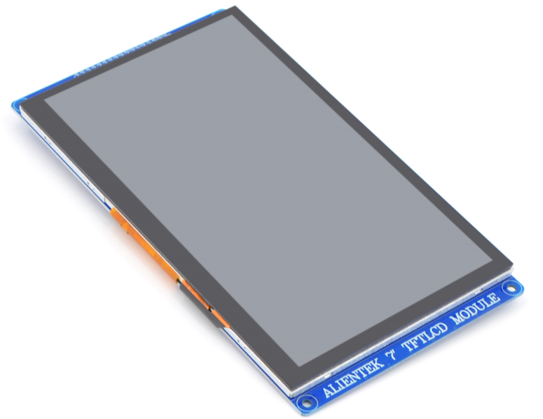
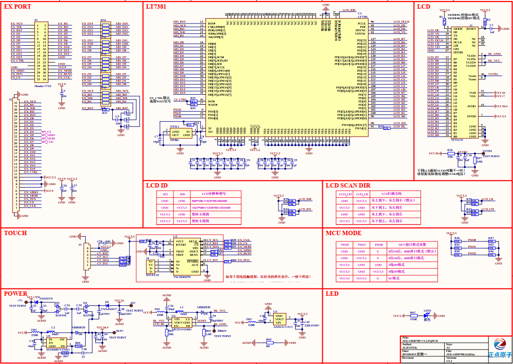

## 1 Introduction

### 1.1 Appearence

The ATK-MD0700 V3 module looks like this:

### 1.2 Features

ATK-MD0700 V3 module is a high-performance 7.0 inch TFTLCD capacitive touch screen module launched by ALIENTEK. The module has two LCD resolutions of **800 * 480** and **1024 * 600**, and supports up to 24 bit true color display. LT7381 as the LCD driver chip, the chip with its own RAM, without external driver or memory, so most of thev several external master controllers can easily drive the module. At the same time, the ATK-MD0700 V3 module also supports touch and uses capacitors touch screen, support 5 points touch at the same time, has a very good control effect.

### 1.3 Parameter

Here are the product basic parameters:

| Parameter               | Description                                                  |
| ----------------------- | ------------------------------------------------------------ |
| Communication Interface | LCD: Intel 8080-8/16 bit parallel port, Intel 6800-8/16 bit parallel port  3-wire SPI, 4-wire SPI, IIC Touch: IIC  |
| Color Format            | Monochrome, RGB332, RGB565, RGB888                           |
| Color Depth             | 1/8/16/24-bit                                                |
| Driver Chip             | LT7381                                                       |
| LCD Resolution          | ATK-MD0700 V3-800480: 800 * 480 ATK-MD0700 V3-1024600:1024*600 |
| Screen Size             | 7.0 inch                                                     |
| Touch Screen Type       | Capacitive touch                                             |
| Touch Point Count       | Up to 5 simultaneous touch points                            |
| Operating Temperature   | -20°C ~ 70°C                                                 |
| Storage Temperature     | -20°C ~ 70°C                                                 |
| Mudule Size             | 100mm*180mm                                                  |

The electrical parameters are shown in the following table:

| Parameter         | Describe                                                     |
| ----------------- | ------------------------------------------------------------ |
| Supply voltage    | 5V                                                           |
| IO port level     | 3.3V                                                         |
| Power dissipation | LCD backlight is off: 175mA Maximum brightness of LCD backlight: 469mA@5V~506mA@5V |

### 1.4 Interface

The ATK-MD0700 V3 module is connected to the external circuit through a 2*17 row pin (2.54mm spacing), each pin is connected to the external circuit. A detailed description is given in the following table:

| Number | Name  | Describe                                                    |
| ------ | ----- | ----------------------------------------------------------- |
| 1      | NCE   | LCD chip selection signal (effective at low level)          |
| 2      | RS    | Command and data control signal (0: command; 1: Data)       |
| 3      | WR    | Write enable signal (valid at low level)                    |
| 4      | RD    | Read enable signal (low level valid)                        |
| 5      | RST   | Reset signal (low level valid)                              |
| 6~21   | D0~D15| BDB(bidirectional data bus)                                 |
| 22,26,27 | GND   | Power ground                                              |
| 28     | 5V    | LCD backlight power supply (5V)                             |
| 29     | MI    | Ununited                                                    |
| 30     | MO    | Touch the IIC communication data signal                     |
| 31     | PEN   | Touch interrupt signal (0: touch; 1: no touch)              |
| 23,24,25,32 | NC  | Ununited                                                 |
| 33     | CS    | Touch reset signal (low level valid)                        |
| 34     | CLK   | Touch the IIC communication clock signal                    |

## 2 Schematic

The schematic diagram of the ATK-MD0700 module is shown as follows.

